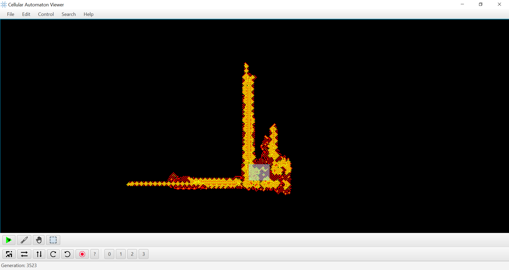
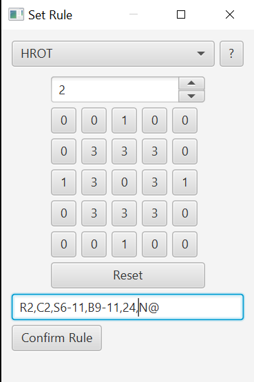
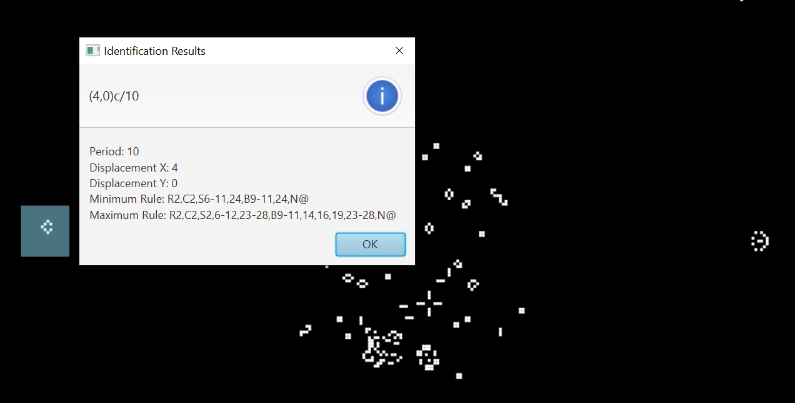

# CAViewer [][Builds link]

[Builds link]: https://github.com/jedlimlx/Cellular-Automaton-Viewer/actions

See python branch for CAViewer v1.

Installation
============
CAViewer v2 is written in Java. 
You will need the Java Runtime Environment / Java Development Kit to run the *.jar file. 

If you can't use Java, download the precompiled binaries 
[here](https://github.com/jedlimlx/Cellular-Automaton-Viewer/actions).  
On Linux and Mac, the binary may not be exectuable by default so run `chmod +x CAViewer`.
This requires a github account.

Alternatively, get the binaries [here](https://github.com/jedlimlx/Cellular-Automaton-Viewer/releases).

Note that this *.jar runs on the Java Runtime Environment / Java Development Kit 11 and above.

See the [wiki](wiki/Home.md) for instructions on how to build the application from source and how to modify it.

What is this?
=============
CAViewer is a cellular automaton simulation program written in Java  
It aims to support rulespaces unsupported by other CA simulation programs such as Golly and LifeViewer.

The GUI
=======
The GUI is made with JavaFX & Scene Builder.

Screenshots
-----------

The Menu Bar
-----------
**File Menu**:  
*New Pattern* - Creates a new pattern  
*Open Pattern* - Opens a pattern file  
*Save Pattern* - Saves the pattern to a file  
*New Rule* - Opens the rule dialog to make a new rule  
*Close* - Closes the application   

**Edit Menu**:  
*Copy* - Copies selected cells to an RLE  
*Paste* - Pastes the cells that are stored as an RLE on the clipboard  
*Delete* - Deletes the selected cells  

**Control Menu**:  
*Set Generation* - Sets the generation based on user input  
*Grid Lines* - Toggles between showing and not showing grid lines  

**Search Menu**:  
*Generate Apgtable* - Generates an apgtable to be used with [apgsearch](https://gitlab.com/apgoucher/apgmera)  
*Run Rule Search* - Starts a search program that randomly enumerates rules to find spaceships & oscillators  

**Help Menu**: 
*About* - Opens the CAViewer Wiki in a built-in browser. 

The Tools Bar
-------------
*Run Simulation Button* - Runs the simulation  
*Drawing Button* - Go into drawing mode  
*Panning Button* - Go into panning mode  
*Selection Button* - Go into selection mode  
 
*Random Soup Button* - Generates a random soup  
*Flip Button* - Flips the pattern horizontally / vertically  
*Rotate Button* - Rotates the pattern clockwise / counter-clockwise (doesn't work)  
*Recording Button* - Records all patterns that move in the selection area and saves it as a \*.gif  
*Identify Button* - Identifies the pattern as a spaceship / oscillator  

The Status Bar
--------------
The generation of the pattern is shown.

Keyboard Shortcuts
------------------
<kbd>Space</kbd> - Step 1 Generation  
<kbd>Enter</kbd> - Toggle Simulation  
<kbd>Delete</kbd> - Deletes cells  

<kbd>Ctrl</kbd> + <kbd>N</kbd> - New Pattern  
<kbd>Ctrl</kbd> + <kbd>O</kbd> - Open Pattern  
<kbd>Ctrl</kbd> + <kbd>S</kbd> - Save Pattern to File  

<kbd>Ctrl</kbd> + <kbd>C</kbd> - Copy Pattern to RLE  
<kbd>Ctrl</kbd> + <kbd>X</kbd> - Cut Pattern (Copy + Delete)  
<kbd>Ctrl</kbd> + <kbd>V</kbd> - Paste Pattern (requires that an area is already selected)  
<kbd>Ctrl</kbd> + <kbd>Shift</kbd> + <kbd>O</kbd> - Load Pattern from Clipboard  

<kbd>Ctrl</kbd> + <kbd>A</kbd> - Select the entire pattern  
<kbd>Ctrl</kbd> + <kbd>Z</kbd> - Undo  

<kbd>Ctrl</kbd> + <kbd>R</kbd> - Change Rule  
<kbd>Ctrl</kbd> + <kbd>5</kbd> - Generate Random Soup  

<kbd>X</kbd> - Flip Selection Horizontally  
<kbd>Y</kbd> - Flip Selection Vertically  
<kbd>></kbd> - Rotate Clockwise  
<kbd><</kbd> - Rotate Counter-Clockwise  

GUI TODO List
-------------
- [x] Add tooltips
- [x] Add menu buttons for delete, paste, copy and cut cells
- [x] Add menu button for new pattern
- [x] Add menu button to open rules & patterns
- [x] Add menu button to save patterns
- [x] Add button to view search results and save to a file
- [x] Add grid lines
- [x] Add help information to the about button
- [ ] Add more information to the status bar
- [ ] Add dialog to ask "Would you like to save changes to untitled"
- [ ] Custom key binds

Editing Features
================
- [x] Drawing Cells
- [x] Selecting Cells
- [x] Delete Cells
- [x] Copy Cells to RLE
- [x] Flip Horizontally / Vertically
- [x] Rotate Clockwise / Counter-Clockwise
- [x] Pasting Cells from RLE
- [x] Undo
- [x] Select All
- [ ] Reset Pattern to Generation 0
- [ ] Nudging up / down / left / right
- [ ] Invert Cells
- [ ] More Random Soup Symmetries
- [ ] Simulate in selection
- [ ] Simulate outside selection

Supported / Planned Rulespaces
==============================
- [ ] Higher Range Outer Totalistic (HROT)
    - [x] 2 State HROT
        - [x] B0 rules
        - [x] Weighted rules
        - [x] Apgtable Generation for B0 rules
        - [x] Apgtable Generation for non-B0 rules
        - [x] Apgtable Generation for weighted rules
    - [ ] HROT BSFKL
        - [ ] B0, F0 rules
        - [ ] Neighbourhood Weights
        - [ ] Apgtable Generation for all rules
    - [ ] HROT Generations
        - [x] B0 Rules
        - [x] State Weights
        - [x] Neighbourhood Weights
        - [x] Apgtable Generation for B0 rules
        - [x] Apgtable Generation for non-B0 rules
        - [x] Apgtable Generation for rules with neighbourhood weights
        - [ ] Apgtable Generation for rules with both state weights & neighbourhood weights
    - [x] HROT Extended Generations
        - [x] B0 Rules
        - [x] Neighbourhood Weights
        - [x] Apgtable Generation for all rules
    - [ ] HROT Regenerating Generations
        - [ ] B0 Rules
        - [ ] Neighbourhood Weights
        - [ ] Apgtable Generation for all rules
    - [ ] 3-state HROT
    - [ ] Integer HROT
    - [ ] Deficient HROT
- [ ] Isotropic Non-Totalistic (INT)
    - [ ] 2 State INT
    - [ ] INT BSFKL
    - [ ] INT Generations
    - [ ] INT Extended Generations
    - [ ] INT Regenerating Generations
    - [ ] 3-state INT
    - [ ] Deficient INT
- [ ] Primodia
- [ ] Naive Rules
    - [ ] Custom Reading Orders
- [ ] Alternating Rules
- [ ] Second Order Rules
- [ ] Multiple Neighbourhoods Cellular Automaton (MNCA)
- [ ] MCell Cyclic CA
- [ ] Yoel's Cyclic CA
- [ ] Langton's Ant / Turnmites
- [ ] Block CA
- [ ] Margolus
- [ ] 1D CA
- [ ] Golly Ruletrees
- [ ] Golly Ruletables
- [ ] Square Cell Ruletables

Supported / Planned INT Neighbourhoods
======================================
- [ ] Range 1 Moore Isotropic Non-Totalistic
- [ ] Range 1 Hexagonal Isotropic Non-Totalistic
- [ ] Range 2 Von Neumann Isotropic Non-Totalistic
- [ ] Range 2 Checkerboard Isotropic Non-Totalistic
- [ ] Range 2 Far Corners Isotropic Non-Totalistic
- [ ] Range 2 Far Edges Isotropic Non-Totalistic
- [ ] Range 2 Knight Life Isotropic Non-Totalistic
- [ ] Range 2 Cross Isotropic Non-Totalistic
- [ ] Range 3 Cross Isotropic Non-Totalistic

Supported / Planned Named HROT Neighbourhoods
=============================================
- [x] Asterisk (A)
- [x] Checkerboard (B)
- [x] Aligned Checkerboard (b)
- [x] Circular (C)
- [ ] Triangular Neighbourhood on Triangular Grid (D)
- [x] Gaussian Weighted Neighbourhood (G)
- [x] Hexagonal (H)
- [x] Triangular Moore (L)
- [x] Moore (M)
- [x] Von Neumann (N)
- [ ] Triangular Neighbourhood on Hexagonal Grid (T)
- [x] Saltire (X)
- [x] Euclidean (2)
- [x] Tripod (3)
- [ ] Hexagram (6)
- [x] Star (*)
- [x] Cross (+)
- [x] Hash (#)
- [x] CoordCA Format (Custom Neighbourhoods @)
- [x] LifeViewer Format (Weighted Neighbourhoods W)
- [x] LifeViewer Format (State Weights W)

Search Programs
===================
- [ ] Rule Search Program
    - [ ] More high tech repetition detection function
    - [ ] Identification for linear growth patterns, replicators
    - [ ] Fine tune RNG function manually
    - [ ] Fine tune RNG function via genetic algorithms?
    - [ ] Object seperation?
- [ ] Agar Search Program
- [ ] Catalyst Search Program
- [ ] Methuselah Search Program

Long-term TODO List
===================
- [x] Custom search programs
- [x] Move stuff to the wiki
- [x] Triangular Rules
- [x] Command Line Interface
    - [x] Simulation
    - [x] Identification
    - [x] Search Programs
    - [x] Apgtable Generation
    - [x] Random Soup / Symmetries Generation
- [ ] Add Unit Tests
    - [x] Write the first one
    - [ ] Rule Families
    - [ ] Simulator
    - [ ] Identification
    - [ ] GUI
- [ ] Bounded Grids
    - [ ] Torus
    - [ ] Klein Bottle & Cross Surface
    - [ ] Spherical
- [ ] Hexagonal Rendering
- [ ] Triangular Rendering
- [ ] Accept some LifeViewer commands like STEP & RANDOMISE
- [ ] Scripting in Python via Jython?
- [ ] Implement a faster algorithm (QuickLife, HashLife...)

Known Bugs
==========
- [x] RLEs are pasted rotated (Fixed)
- [x] Open pattern is bugged (Fixed)
- [x] HROT B0 isn't working as intended (Fixed)
- [x] Keyboard shortcuts only work when the ScrollPane is in focus (Fixed)
- [x] Rule Dialog don't show the most updated rule (Fixed)
- [x] ConcurrentModificationException is thrown (Fixed)
- [x] Step with space causes some cells to be rendered incorrectly (Fixed)
- [ ] Viewport doesn't move the center when a new pattern is loaded
