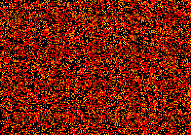

This rule has a wide variety of oscillators as well as a [puffer](PUFF_1.rle) engine coined "oscillator-laying switch engine".
In addition, there is a natural [3c/56d ship](SHIP_1.rle).

[Catagolue census](https://catagolue.hatsya.com/census/x17x16x11x6x3xr1_d0_s2-3_b1_4_nn)

**Known Periods**  
[2]  
[4]  
[5]  
[6]  
[8]  
[10]  
[13]  
[14]  
[16]  
[21]  
[22]  
[30]  
And alot more...

[2]: OSC_1.rle
[4]: OSC_2.rle
[5]: OSC_3.rle
[6]: OSC_4.rle
[8]: OSC_5.rle
[10]: OSC_6.rle
[13]: OSC_7.rle
[14]: OSC_8.rle
[16]: OSC_9.rle
[21]: OSC_10.rle
[22]: OSC_11.rle
[30]: OSC_12.rle
