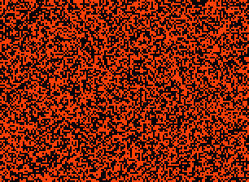

A very active rule with a common glide-symmetric [8c/28o] that moves from right to left to right.

[Catagolue census](https://catagolue.appspot.com/census/x32x31x22x14x3xr2_b3_8_10-12_s1-2_10_g0-1-1-3_nn)

*Known Periods*   
[8]  
[12]  
[20]

*Known Speeds*  
[c/4d]  
[2c/8d]  
[4c/16d]  
[8c/28o]

[8]: OSC_1.rle
[12]: OSC_2.rle
[20]: OSC_3.rle

[c/4d]: SHIP_1.rle
[2c/8d]: SHIP_2.rle
[4c/16d]: SHIP_3.rle
[8c/28o]: SHIP_4.rle