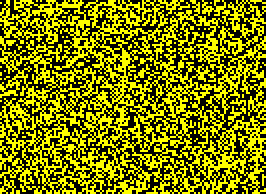

## efiL8draobrekcehC (R2,B3,S2-3,8,G0-1-1,NB)

A stable snoitreneg rule with common [P4] oscillators and a [c/2o]. Still lives exist although they are fairly uncommon.

The [P4] oscillator can [eat](INT_1.rle) the [c/2o] and the [c/2o] can pass through the [P4] [destroying](INT_2.rle) it.

In fact, any oscillator and spaceship pair that each have consist of only one state and have opposite states 
are able to destroy the other without being affected.

[Catagolue census](https://catagolue.appspot.com/census/x21x20x13x6x3xr2_b3_s2-3_8_g0-1-1_nb)

**Known Periods**  
[4]  
[8]  
[16]  
[40]  
[69]

**Known Speeds**  
[c/2o]  
[c/4d]  
[c/4o]  
[2c/8o]

[P4]: OSC_1.rle
[4]: OSC_1.rle
[8]: OSC_2.rle
[16]: OSC_3.rle
[40]: OSC_4.rle
[69]: OSC_5.rle

[c/2o]: SHIP_1.rle
[c/4d]: SHIP_2.rle
[c/4o]: SHIP_3.rle
[2c/8o]: SHIP_4.rle
