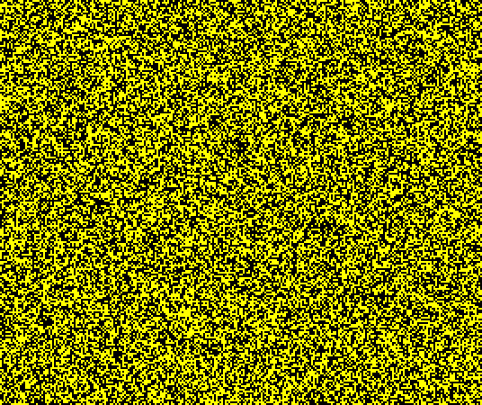

This is a reverse generations variant of the rule Pigs. 
It has a failed replicator as well as a [32c/96o linear replicator](REP_1.rle).
In addition, there are many high period oscillators.

**Known Speeds**  
[c/4o](SHIP_1.rle)  
[c/8o](SHIP_2.rle)  

**Known Periods**  
[4](OSC_2.rle)  
[22](OSC_1.rle)  
And many more...
