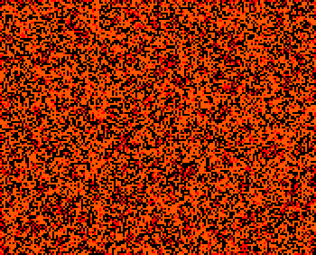

## CheckerboardPedestrianLife

A checkerboard rule with a variety of speeds including [7c/171o], [(1, 7)c/14] and a common photon.

There is also a [diagonal rake] and [orthogonal puffer]. The latter can be corderised to form a P24 photon.

In addition, a handful of oscillator periods have been found with the most common being the rotating [P24].

[Catagolue census](https://catagolue.appspot.com/census/x16x11x6x3xr2_c5_s2-3_b3_8_checkerboard)

**Known Speeds**  
[c/1o]  
[2c/2o]  
[c/3o]  
[2c/4d]  
[4c/4o]  
[c/6d]  
[(1, 7)c/14]  
[7c/171o]  

**Known Periods**  
[5]  
[6]  
[9]  
[18]  
[24]  

[c/1o]: SHIP_1.rle
[2c/2o]: SHIP_2.rle
[c/3o]: SHIP_3.rle
[2c/4d]: SHIP_4.rle
[4c/4o]: SHIP_5.rle
[c/6d]: SHIP_6.rle
[(1, 7)c/14]: SHIP_7.rle
[7c/171o]: SHIP_8.rle

[5]: OSC_1.rle
[6]: OSC_2.rle
[9]: OSC_3.rle
[18]: OSC_4.rle
[24]: OSC_5.rle
[P24]: OSC_5.rle

[orthogonal puffer]: PUFF_1.rle
[diagonal rake]: RAKE_1.rle
