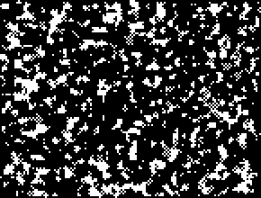

## R2,C2,S0-3,11,B0-5,NN

A chaotic B0 rule that has many high period wacky objects such as the [30c/268o] and the [P1396] oscillator.

Multiple [30c/268o]s can be combined to form [puffers](PUFF_1.rle).

[Catagolue census](https://catagolue.appspot.com/census/x20x19x14x6x3xr2_c2_s0-3_11_b0-5_nn)

**Known Periods:**  
[4]  
[8]  
[10]  
[14]  
[16]  
[20]  
[62]  
[76]  
[1396]  

[4]: OSC_1.rle
[8]: OSC_2.rle
[10]: OSC_3.rle
[14]: OSC_4.rle
[16]: OSC_5.rle
[20]: OSC_6.rle
[40]: OSC_11.rle
[62]: OSC_7.rle
[76]: OSC_8.rle
[1396]: OSC_9.rle
[P1396]: OSC_9.rle

[30c/268o]: SHIP_1.rle