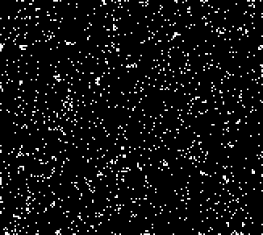

A stable rule that has a variety of natural speeds as well as an [(5, 8)c/18 puffer] that can be corderised.

There is also a common P8 oscillator that looks like a shaker. 
In addition, there is a common still life that looks like a sideways 8. It is formed from a beehive predecessor.

[Catagolue census](http://catagolue.appspot.com/census/x15x14x9x6x3xr2_c2_s2_b3_9_nn)

**Known Speeds**  
[c/2d]  
[2c/4o]  
[c/6d]  
[c/10d]  
[3c/11o]  
[(4, 5)c/16]  
[(5, 8)c/18]  
[2c/28d]  

**Known Periods**  
[2]  
[3]  
[4]  
[5]  
[8]  
[14]  
[15]  
[16]  
[18]  
[42]  

[c/2d]: SHIP_1.rle
[2c/4o]: SHIP_2.rle
[c/6d]: SHIP_3.rle
[c/10d]: SHIP_4.rle
[3c/11o]: SHIP_5.rle
[(4, 5)c/16]: SHIP_6.rle
[(5, 8)c/18]: SHIP_7.rle
[2c/28d]: SHIP_8.rle

[2]: OSC_1.rle
[3]: OSC_2.rle
[4]: OSC_3.rle
[5]: OSC_4.rle
[8]: OSC_5.rle
[14]: OSC_6.rle
[15]: OSC_7.rle
[16]: OSC_8.rle
[18]: OSC_9.rle
[42]: OSC_10.rle

[(5, 8)c/18 puffer]: PUFF_1.rle