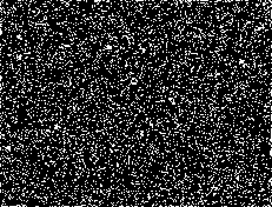

## R2,C2,S4,6,7,22-24,B6,7,13,14,18,19,22,NM

An active rule that has a common [P38] oscillator and a glide-symmetric [4c/16o].

It also has a sparky [4c/27d] which has yet to be turned into a rake / puffer.

The [P38] oscillator can also hassle still lives and form non-trivial oscillators such as the [P152].

[Catagolue Census](https://catagolue.appspot.com/census/r2b263060se00068)

**Known Speeds**  
[c/1o]  
[c/2o]  
[c/2d]  
[2c/2o]  
[c/8d]  
[4c/16o]  
[4c/27d]  

**Known Periods**  
[2]  
[3]  
[4]  
[5]  
[6]  
[8]  
[11]  
[22]  
[38]  
[152]  

[2]: OSC_1.rle
[3]: OSC_2.rle
[4]: OSC_3.rle
[5]: OSC_4.rle
[6]: OSC_5.rle
[8]: OSC_6.rle
[11]: OSC_7.rle
[22]: OSC_8.rle
[38]: OSC_9.rle
[P38]: OSC_9.rle
[152]: OSC_10.rle
[P152]: OSC_10.rle

[c/1o]: SHIP_1.rle
[c/2o]: SHIP_2.rle
[c/2d]: SHIP_3.rle
[2c/2o]: SHIP_4.rle
[c/8d]: SHIP_5.rle
[4c/16o]: SHIP_6.rle
[4c/27d]: SHIP_7.rle

