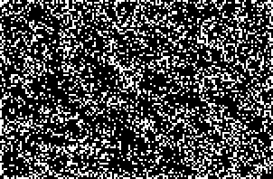

## R2,C2,S5-8,12,16-18,B6,16-18,NH

A hexagonal rule with a common [3c/6o] and [c/2o].

There are also a handful of known oscillator periods.

[Catagolue census](https://catagolue.appspot.com/census/x30x29x20x6x3xr2_c2_s5-8_12_16-18_b6_16-18_nh)

**Known Periods**  
[2]  
[3]  
[4]  
[5]  
[6]  
[7]  
[8]  
[9]  
[24]

[2]: OSC_1.rle
[3]: OSC_2.rle
[4]: OSC_3.rle
[5]: OSC_4.rle
[6]: OSC_5.rle
[7]: OSC_6.rle
[8]: OSC_7.rle
[9]: OSC_8.rle
[24]: OSC_9.rle

[c/2o]: SHIP_1.rle
[3c/6o]: SHIP_2.rle