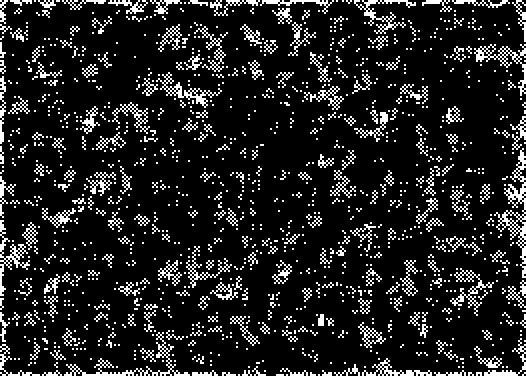

An extremely active but not explosive rule.

The most common oscilator is a [P2] phoenix. There is also a odd-looking [P16].

There are also a number of photons and 2 [c/2d] spaceships.

[Catagolue census](https://catagolue.appspot.com/census/x26x25x17x6x3xr3_c2_s6-9_20-24_b6-8_20_nb)

**Known Periods**  
[2]  
[4]  
[6]  
[8]  
[16]  

**Known Speeds**  
[c/1o]  
[c/2d]  

[P2]: OSC_1.rle
[P16]: OSC_6.rle
[2]: OSC_1.rle
[4]: OSC_2.rle
[6]: OSC_3.rle
[8]: OSC_4.rle
[16]: OSC_5.rle
[c/1o]: SHIP_1.rle
[c/2d]: SHIP_2.rle