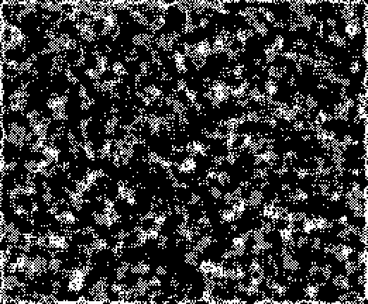

An active checkerboard rule with 2 common photons and common P4 oscillators.

Has [P1] & [P2] photons as well as a [2c/10o] spaceship.

[Catagolue Census](https://catagolue.appspot.com/census/x18x17x11x6x3xr3_c2_s6-9_b7-10_nb)

**Known Periods**  
[2](OSC_1.rle)  
[3](OSC_2.rle)  
[4](OSC_3.rle)  
[5](OSC_4.rle)  
[6](OSC_5.rle)  
[8](OSC_6.rle)  
[12](OSC_7.rle)  

[P1]: SHIP_1.rle
[P2]: SHIP_2.rle
[2c/10o]: SHIP_3.rle