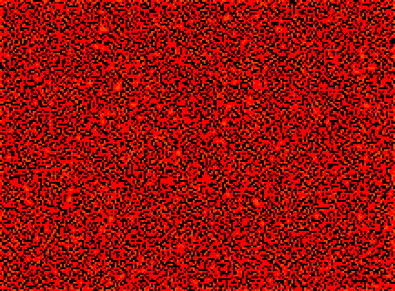

An explosive generations rule that has similar dynamics to star wars.

However, unlike Star Wars, in this rule, stable circuitry is hard to construct.

Most ships move at lightspeed. There is also a common [c/2o] ship and a [2c/4d] ship.

In addition, there is also a common [55 generation diehard].

[]

[c/2o]: SHIP_2.rle
[2c/4d]: SHIP_3.rle
[55 generation diehard]: DIE_1.rle