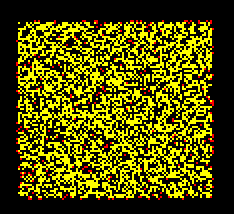

## 1ca2x3ac4adjanawa/2aacaeaiakana/3/V2

This rule has a common P20 RRO. Multiple P20 RROs can merge to 
form various larger oscillators and spaceships.

[Catagolue census](https://catagolue.hatsya.com/census/x38x37x34x15xb2aacaeaiakana_s1ca2x3ac4adjanawa_c3_nv2)

**Known Periods**  
[4](OSC_1.rle)  
[10](OSC_2.rle)  
[20](OSC_3.rle)  
[26](OSC_4.rle)  
[30](OSC_5.rle)

**Known Speeds**  
[1c/1o](SHIP_1.rle)  
[2c/2o](SHIP_2.rle)  
[10c/26o](SHIP_3.rle)  
[2c/35o](SHIP_4.rle)  
[3c/54d](SHIP_5.rle)  
[12c/60d](SHIP_6.rle)

**Linear Growth**  
[P20 Gun](GUN_1.rle)  
[P30 Gun](GUN_2.rle)  
[P60 Gun](GUN_3.rle)  
[(15, 3)c/45 Rake](RAKE_1.rle)
