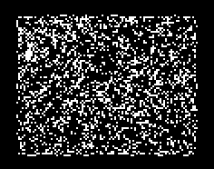

## B2ec3aacaeaia4x6x8x/S2x3x/NV2

An active rule with a common [c/13o] and [c/4d]. [c/13o]s can combine to form [P51] OMOSs or combine with 
oscillators to form higher-period oscillators ([P96]). Other spaceships such as a [c/2o] and a [2c/4o] have also 
been found.

[Catagolue census](https://catagolue.hatsya.com/census/x27x26x20xb2ec3aacaeaia4x6x8x_s2x3x_nv2)

**Known Periods**  
[2]  
[3]  
[4]  
[6]  
[8]  
[9]  
[14]  
[18]  
[51]  
[64]  
[96]  
[166]  

**Known Speeds**  
[c/2o]  
[c/4d]  
[2c/4o]  
[c/13o]  

[2]: OSC_1.rle
[3]: OSC_2.rle
[4]: OSC_3.rle
[6]: OSC_4.rle
[8]: OSC_5.rle
[9]: OSC_6.rle
[14]: OSC_7.rle
[18]: OSC_8.rle
[51]: OSC_9.rle
[P51]: OSC_9.rle
[64]: OSC_10.rle
[96]: OSC_11.rle
[P96]: OSC_11.rle
[166]: OSC_12.rle

[c/2o]: SHIP_1.rle
[c/4d]: SHIP_2.rle
[2c/4o]: SHIP_3.rle
[c/13o]: SHIP_4.rle