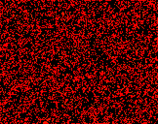

## IntegerLife (R1,I8,S2-3,B3,NM)

A chaotic rule by Mark Niemiec. All patterns in Life work excluding those involving B6. 
Other than the glider and the xWSS, this rule also has a natural [2c/6o], [c/3o] and [3c/11o]. 
There is also a natural [backrake] and a [gun] has been constructed.
This collection excludes Life patterns.

[Conwaylife thread](https://conwaylife.com/forums/viewtopic.php?f=11&t=4733)

[Catagolue census](https://catagolue.appspot.com/census/x15x14x11x6x3xr1_i8_s2-3_b3_nm)

**Known Periods**  
[2]  
[3]  
[4]  
[5]  
[6]  
[7]  
[8]  
[9]  
[10]  
[11]  
[14]  
[44]  
[58]  

**Agars**  
[P6](AGAR_1.rle)

[2]: OSC_1.rle
[3]: OSC_2.rle
[4]: OSC_3.rle
[5]: OSC_4.rle
[6]: OSC_5.rle
[7]: OSC_6.rle
[8]: OSC_7.rle
[9]: OSC_8.rle
[10]: OSC_9.rle
[11]: OSC_10.rle
[14]: OSC_11.rle
[44]: OSC_12.rle
[58]: OSC_13.rle

[2c/6o]: SHIP_1.rle
[c/3o]: SHIP_2.rle
[3c/11o]: SHIP_3.rle

[backrake]: RAKE_1.rle
[gun]: GUN_1.rle
