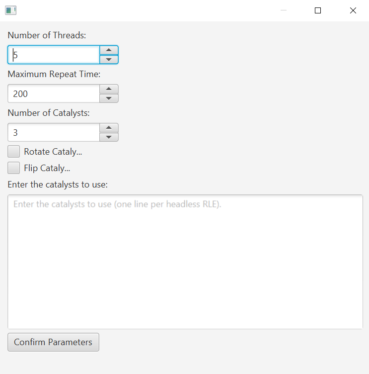

## Rule Search

#### TODO
- [x] More high tech repetition detection function
- [x] Identification for linear growth patterns, replicators
- [ ] Fine tune RNG function manually
- [ ] Fine tune RNG function via genetic algorithms?
- [ ] Object seperation?

### How it works
Rule search randomly enumerates rules between a minimum and maximum rule.

A seed such as this (select with selection tool)
```
x = 6, y = 6, rule = R2,C2,M1,S7..10,B7..8,NM
3bo$b2o$2o3bo$b2obo$2b3o$3bo!
```
is used.

Rule search runs the seed in the random rule that is generated and check if the pattern is a spaceship or an oscillator.
It is similar to [searchRule-matchPatt2.py](https://github.com/apaap/sssss/blob/master/scripts/searchRule-matchPatt2.py).

### Usage & Parameters
1. Select the pattern to be used as a seed in the simulator.
2. Click *Run Rule Search* under *Search*. A dialog will open.
3. Fill in the parameters and click *Confirm Parameters*.

*Number of Threads:* Number of threads used for multi-threading <br>
*Max Period:* Maximum period to detect <br>
*Min Population:* Minimum population before quitting identification <br>
*Max Population:* Maximum population before quitting identification <br>
*Max Width:* Maximum width before quitting identification <br>
*Max Height:* Maximum height before quitting identification <br>
*Minimum Rule:* Minimum rule for randomisation <br>
*Maximum Rule:* Maximum rule for randomisation <br>

4. A another dialog will open that displays the search results.

Right click on each item for some options. You may click on the top of the table to sort the items alphabetically.

*Show in Application:*  Shows the rule that the pattern was found in in the application along with the pattern. <br>
*Show Min Rule in Application:* Shows the minimum rule in the application along with the pattern. <br>
*Show Max Rule in Application:* Shows the maximum rule in the application along with the pattern. <br>
*Copy RLE to Clipboard:* Copies the RLE of the pattern to the clipboard. <br>

There are also some buttons at the bottom. <br>
*Reload Data:* Reloads the table for new search results <br>
*Terminate Search:* Terminates the search <br>
*Save Results:* Saves the results in a *.csv file. <br>

### Tips
A good seed is crucial for getting good results. Typically, good seeds are stuff like spaceships that can exist in a wide variety of rules.

It is also important to suitably restrict the rule range. For example, a Minibugs ship should have a rule range of something like `R2,C2,S6-8,B7,NM - R2,C2,S0-3,6-9,12-24,B7-8,12-24,NM` to get decent results.

## Catalyst Search

#### TODO
- [x] Mutiple catalysts
- [ ] Brute force option
- [ ] Symmetries
- [ ] Repetition detection

### How it works
Catalyst search works by randomly enumerates configurations of still lives in a search area. 
When a still life is interacted with and regenerates after a period of time in the same place, it is known as a catalyst. 
The time taken for the catalyst to regenerate and become usable again is known as the repeat time.

### Usage & Parameters
1. Draw the target pattern in the simulator
2. Select the search area where the catalysts will be placed with the selection tool. For example, like this:

3. Click *Run Catalyst Search* under *Search*
4. Fill in the parameters and click *Confirm Parameters*.

*Number of Threads:* Number of threads used for multi-threading <br>
*Maximum Repeat Time:* Maximum repeat time to check for <br>
*Number of Catalysts:* Number of catalysts to place in the search area <br>
*Rotate Catalysts:* Should the catalysts be rotated? <br>
*Flip Catalysts:* Should the catalysts be flipped? <br>
*Catalysts:* Add the catalysts to use a headerless RLEs in the textbox one per line <br>



5. Another dialog will open to show the search results.

Right click on each item for some options. You may click on the top of the table to sort the items alphabetically.

*Show in Application:*  Shows the catalyst in the application. <br>
*Copy RLE to Clipboard:* Copies the RLE of the catalyst to the clipboard. <br>

There are also some buttons at the bottom. <br>
*Reload Data:* Reloads the table for new search results <br>
*Terminate Search:* Terminates the search <br>
*Save Results:* Saves the results in a *.csv file. <br>

## Brute Force / Soup Search

#### TODO
- [ ] Object seperation
- [ ] Symmetries
- [ ] Finish Documentation

## Agar Search
Support for an agar search program in CAViewer is planned.

## Methusulah Search
Support for an methusulah search program in CAViewer is planned.
